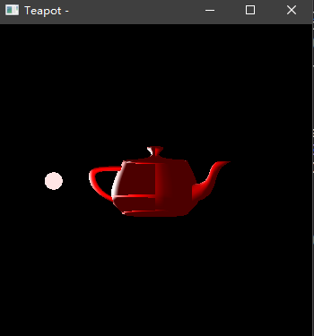

# 计算机图形学 第十六周实践报告

+ 姓名：朱桐
+ 学号：10175102111

## 配环境

mingw-w64 + cmake 安装 freeglut

[tutorial](https://medium.com/@bhargav.chippada/how-to-setup-opengl-on-mingw-w64-in-windows-10-64-bits-b77f350cea7e)

cmake 文件

```cpp
project(week16)
add_executable(teapot teapot.cpp)
target_link_libraries(teapot libopengl32.a libglu32.a libfreeglut.dll.a)
set_property(TARGET teapot PROPERTY CXX_STANDARD 17)
```

## 绘制茶壶

```cpp
glutSolidTeapot(radius);
```


## 光照

设置强度

```cpp
GLfloat qaBlack[] = {0.0, 0.0, 0.0, 1.0};  // Black Color
GLfloat qaGreen[] = {1.0, 0.0, 0.0, 1.0};  // Green Color
GLfloat qaWhite[] = {1.0, 1.0, 1.0, 1.0};  // White Color
GLfloat qaRed[] = {1.0, 0.0, 0.0, 1.0};    // Red Color

// Set lighting intensity and color
GLfloat qaAmbientLight[] = {0.1, 0.1, 0.1, 1.0};
GLfloat qaDiffuseLight[] = {1, 1, 1, 1.0};
GLfloat qaSpecularLight[] = {1.0, 1.0, 1.0, 1.0};
GLfloat emitLight[] = {0.9, 0.9, 0.9, 0.01};
GLfloat Noemit[] = {0.0, 0.0, 0.0, 1.0};
// Light source position
GLfloat qaLightPosition[] = {0, 0, 0, 1};   // Positional Light
GLfloat qaLightDirection[] = {1, 1, 1, 0};  // Directional Light
```

初始化

```cpp
void initLighting() {
    // Enable lighting
    glEnable(GL_LIGHTING);
    glEnable(GL_LIGHT0);

    // Set lighting intensity and color
    glLightfv(GL_LIGHT0, GL_AMBIENT, qaAmbientLight);
    glLightfv(GL_LIGHT0, GL_DIFFUSE, qaDiffuseLight);
    glLightfv(GL_LIGHT0, GL_POSITION, qaLightPosition);
    glLightfv(GL_LIGHT0, GL_SPECULAR, qaSpecularLight);
    ////////////////////////////////////////////////
}
```

旋转光源

```cpp

void idleFunc(void) {
    if (zRotated > 360.0) {
        zRotated -= 360.0 * floor(zRotated / 360.0);  // Don't allow overflow
    }

    if (yRotated > 360.0) {
        yRotated -= 360.0 * floor(yRotated / 360.0);  // Don't allow overflow
    }
    zRotated += 0.1;
    yRotated += 0.1;

    display();
}


void display(void) {
    glMatrixMode(GL_MODELVIEW);
    // clear the drawing buffer.
    glClear(GL_COLOR_BUFFER_BIT);
    // clear the identity matrix.
    glLoadIdentity();

    glTranslatef(0.0, 0.0, -20.0);

    glPushMatrix();

    glTranslatef(0.0, 0.0, 0);
    // Set material properties
    glMaterialfv(GL_FRONT_AND_BACK, GL_AMBIENT, qaRed);

    glMaterialfv(GL_FRONT_AND_BACK, GL_DIFFUSE, qaRed);

    glMaterialfv(GL_FRONT_AND_BACK, GL_SPECULAR, qaWhite);

    glMaterialf(GL_FRONT_AND_BACK, GL_SHININESS, 1);

    glutSolidTeapot(radius);
    glPopMatrix();

    glPushMatrix();
    glRotatef(yRotated, 0.0, 1.0, 0.0);
    glTranslatef(5.0, 0.0, 0.0);
    glMaterialfv(GL_FRONT_AND_BACK, GL_EMISSION,
                 emitLight);  // Make sphere glow (emissive)
    glutSolidSphere(radius / 6, 25, 25);
    glMaterialfv(GL_FRONT_AND_BACK, GL_EMISSION, Noemit);
    glPopMatrix();

    glPushMatrix();
    glRotatef(-yRotated, 0.0, 1.0, 0.0);
    glTranslatef(5.0, 0.0, 0.0);
    glLightfv(GL_LIGHT0, GL_POSITION, qaLightPosition);
    glPopMatrix();

    glFlush();
    glutSwapBuffers();
}

///....


    glutIdleFunc(idleFunc);
    glutDisplayFunc(display);
```


## 效果

