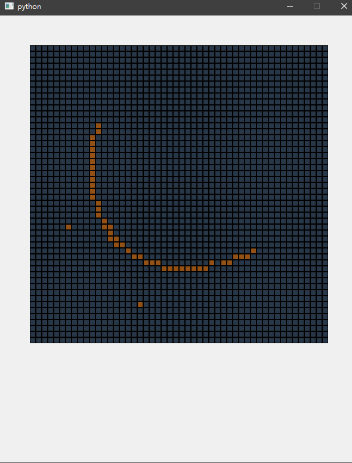
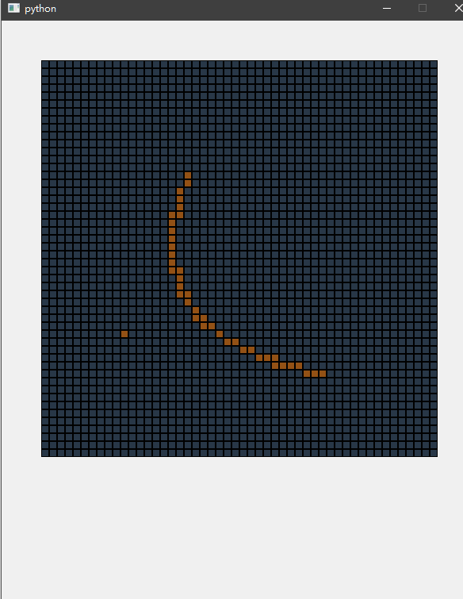

# 计算机图形学 第七次实践报告

+ 姓名：朱桐
+ 学号：10175102111


## Bezier 曲线

$B(t) = \sum\limits_{i=1}^{n}\binom{n}{i}P_i(1-t)^{n-i}t^{i}$


```py
from ..common.grid import Grid, Node
from ..week2.bresenham import bresenham
from PyQt5 import QtWidgets
from PyQt5.QtWidgets import (
    QWidget,
    QLabel,
    QApplication,
    QStackedWidget,
    QVBoxLayout,
    QGridLayout,
    QFrame,
    QPushButton,
)

from PyQt5.QtCore import Qt


def bezier(ctrl_p, num, func):
    n = len(ctrl_p) - 1
    for j in range(num):
        t = 1 / num * j
        tt = pow(1 - t, n)
        t = t / (1 - t)
        x = 0
        y = 0
        coef = 1
        for i in range(n + 1):
            x += coef * tt * ctrl_p[i][0]
            y += coef * tt * ctrl_p[i][1]
            coef = coef * (n - i) // (i + 1)
            tt *= t
        func(round(x), round(y))
    pass


class BezierGrid(Grid):
    def __init__(self, num_nodes, **params):
        super().__init__(**params)
        self.p = []
        self.num_nodes = num_nodes

    def dispach(self, node, event):
        if event.button() == Qt.RightButton:
            bezier(self.p, self.num_nodes, self.toggle)
        else:
            self.toggle(node.x, node.y, 1)
            self.p.append((node.x, node.y))

    pass


if __name__ == "__main__":
    import sys

    app = QtWidgets.QApplication(sys.argv)
    gui = BezierGrid(n=50, num_nodes=50)
    gui.show()
    sys.exit(app.exec_())

```


## 效果




