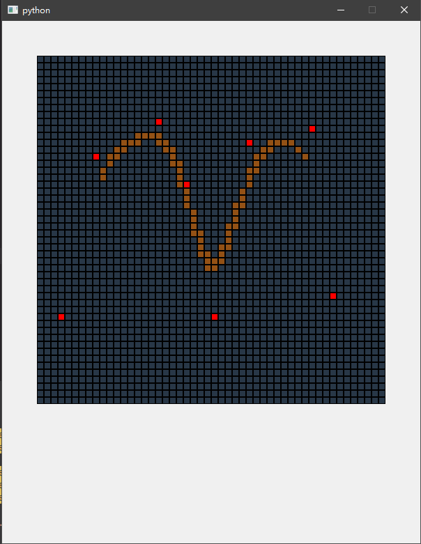

# 计算机图形学 第七次实践报告

+ 姓名：朱桐
+ 学号：10175102111


## 3次均匀B样条曲线 

$P(u) = \sum\limits_{k=0}^{n}p_kB_{k,d}(u)$

在均匀 B 样条曲线中

$B_{j,n}(t) = B_n(t+n-j)$

类似于重复采样的感觉

对于3次均匀B样条曲线有

$B_0(t) = \frac{(1-t)^3}{6}$

$B_1(t) = \frac{3t^3-6t^2+4}{6}$

$B_2(t) = \frac{-3t^3+3t^2+3t+1}{6}$

$B_3(t) = \frac{t^3}{6}$


```py
from ..common.grid import Grid, Node
from ..week2.bresenham import bresenham
from PyQt5 import QtWidgets
from PyQt5.QtWidgets import (
    QWidget,
    QLabel,
    QApplication,
    QStackedWidget,
    QVBoxLayout,
    QGridLayout,
    QFrame,
    QPushButton,
)

from PyQt5.QtCore import Qt


def B0(u):
    return (1-u)*(1-u)*(1-u)/6

def B1(u):
    return (3*u*u*u-6*u*u+4) / 6

def B2(u):
    return (-3*u*u*u+3*u*u+3*u+1) / 6

def B3(u):
    return u*u*u/6

def bspine3(p, func):
    if len(p) < 4:
        print("should have 4 control points")
        exit()


    n = len(p)

    P = 100
    for base in range(n-3):
        for i in range(P+1):
            t = i / P
            
            x = 0
            y = 0
            B = [B0, B1, B2, B3]
            for j in range(4):
                pj = p[base+j]
                x += pj[0] * B[j](t)
                y += pj[1] * B[j](t)

            func(round(x), round(y))

    
class BspineGrid(Grid):

    def __init__(self, **params):
        super().__init__(**params)
        self.p = []

    def dispach(self, node, event):
        if event.button() == Qt.RightButton:
            bspine3(self.p, self.toggle)
        else:
            self.toggle(node.x, node.y, 1)
            self.p.append((node.x, node.y))
    pass

if __name__ == "__main__":
    import sys

    app = QtWidgets.QApplication(sys.argv)
    gui = BspineGrid(n=50)
    gui.show()
    sys.exit(app.exec_())
```


## 效果


