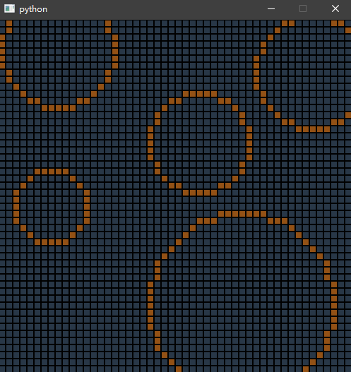

# 计算机图形学 第三周实践报告

+ 姓名：朱桐
+ 学号：10175102111

## 界面

更新了一个界面，支持鼠标操作，参数传进去一个 `callback` 函数，所以子类只需要重写 `grid_click` 函数就可以实现相应的响应功能，函数参数就是被点击的 `Node`，其中 `Node` 带有 `x,y` 属性分别表示横纵坐标

```py
import sys
from PyQt5 import QtWidgets
from PyQt5.QtWidgets import (
    QWidget,
    QLabel,
    QApplication,
    QStackedWidget,
    QVBoxLayout,
    QGridLayout,
    QFrame,
)

from PyQt5.QtCore import Qt


class Node(QFrame):
    def toggle(self, state=None):
        if state is None:
            self.on = not self.on
        else:
            self.on = state
        self.update()

    def update(self):
        if self.on:
            self.setStyleSheet("background-color: #935115;border: 1px solid black;")
        else:
            self.setStyleSheet("background-color: #283747;border: 1px solid black;")

    def mousePressEvent(self, event):
        self.call_back(self)
        pass

    def __init__(self, size, mainWindow, x, y, call_back):
        super(Node, self).__init__(mainWindow)
        self.setFixedSize(size, size)
        self.grid = mainWindow
        self.on = False
        self.update()

        self.x = x
        self.y = y
        self.call_back = call_back


class Grid(QWidget):
    def __init__(self, n, size=500):
        super().__init__()
        self.n = n
        self.size = size
        self.setFixedSize(size, size)
        self.setStyleSheet("background-color: #283747;")
        grid_size = size // n
        self.grid = [
            [
                Node(grid_size, self, j, self.n - 1 - i, self.grid_click)
                for i in range(n)
            ]
            for j in range(n)
        ]

        for i in range(n):
            for j in range(n):
                node = self.grid[i][j]
                node.move(i * grid_size, j * grid_size)

        self.click_queue = []

    def grid_click(self, node):
        pass

    def toggle(self, x, y, state=True):
        n = self.n
        if x < 0 or x >= n or y < 0 or y >= n:
            return
        self.grid[x][self.n - 1 - y].toggle(state)


    pass


if __name__ == "__main__":
    import sys

    app = QtWidgets.QApplication(sys.argv)
    gui = Grid(10)
    gui.toggle(5, 5)
    gui.show()
    sys.exit(app.exec_())

```


## 画圆算法

借助 bresenham 算法的思想，还是挑选一段 x 轴变化更慢的区域然后计算 y 的值，其中可以通过增量求解的方式避免求根计算，从而使运算效率达到更高

由于圆是完全中心对称的，所以直接可以把八个方向的点一起画好，这样就不用再讨论过了这个圆弧还需要考虑 y 轴变化更加缓慢的情况

有了新版的框架，只需要写 `draw_circle` 函数并重写 `grid_click` 函数就可以快速实现要求

```py
from ..common.grid import Grid, Node
from math import sqrt


def draw_circle(xc, yc, r, set_pixel):
    def plot_points(pt):
        for si in [-1, 1]:
            for sj in [-1, 1]:
                set_pixel(xc + si * pt[0], yc + sj * pt[1])
                set_pixel(xc + si * pt[1], yc + sj * pt[0])

    p = 1 - r
    pt = [0, r]
    plot_points(pt)
    while pt[0] < pt[1]:
        pt[0] += 1
        if p < 0:
            p += 2 * pt[0] + 1
        else:
            pt[1] -= 1
            p += 2 * (pt[0] - pt[1]) + 1
        plot_points(pt)


class CircleGrid(Grid):
    def __init__(self, circle_func, **params):
        super().__init__(**params)
        self.circle_func = circle_func
        self.p = None

    def grid_click(self, node):
        if self.p is None:
            self.p = [node.x, node.y]
        else:
            dx = self.p[0] - node.x
            dy = self.p[1] - node.y
            r = int(sqrt(dx ** 2 + dy ** 2) + 0.5)
            draw_circle(self.p[0], self.p[1], r, self.toggle)
            self.p = None


import sys
from PyQt5 import QtWidgets

app = QtWidgets.QApplication(sys.argv)
gui = CircleGrid(n=50, circle_func=draw_circle)
gui.show()
sys.exit(app.exec_())
```

## 效果

