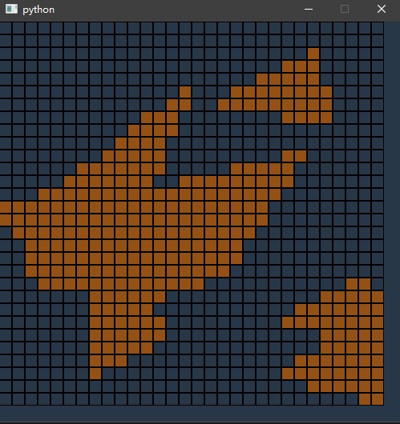

# 计算机图形学 第四周实践报告

+ 姓名：朱桐
+ 学号：10175102111

本次实验代码量相较前两次较大

## 计算几何库

`./common/geometry.py`

简单实现一下计算几何库，主要实现线段与直线交点的算法

```py
from typing import List

INF = 10000000000
MAGIC = 998244353
MOD = 1000000007


class Vector2:
    def __init__(self, x, y):
        self.p = [x, y]

    def __add__(self, other):
        return Vector2(self.p[0] + other.p[0], self.p[1] + other.p[1])

    def __sub__(self, other):
        return Vector2(self.p[0] - other.p[0], self.p[1] - other.p[1])

    def dot(self, other):
        return self.p[0] * other.p[0] + self.p[1] * other.p[1]

    def det(self, other):
        return self.p[0] * other.p[1] - self.p[1] * other.p[0]

    def __eq__(self, other):
        return self.p[0] == other.p[0] and self.p[1] == other.p[1]

    def __hash__(self):
        return (self.p[0] * MAGIC + self.p[1]) % MOD

    def __getitem__(self, index: int):
        return self.p[index]


class Point2(Vector2):
    def __init__(self, x, y, **params):
        super().__init__(x, y)

    def transpose(self):
        return Point2(self.p[1], self.p[0])

    pass


class Line2:
    def __init__(self, a: Point2, b: Point2):
        self.a = a
        self.b = b

    def get_direction(self):
        return self.b - self.a

    def y_bound(self):
        l, r = self.a[1], self.b[1]
        if l > r:
            l, r = r, l
        return (l, r)

    def get_x(self, y):
        '''
        return (indicator, result)
        if indicator = -1, then there is no cross point
        else if indicator = 0, then cross line is exact the same as the segment
        else the result is the corresponding cordinate
        '''
        yl, yr = self.y_bound()
        if y < yl or y > yr:
            return (-1, 0)
        elif self.a[1] == self.b[1]:
            return (0, self.a[0])
        else:
            ratio = (y - self.a[1]) / (self.b[1] - self.a[1])
            return (1, ratio * (self.b[0] - self.a[0]) + self.a[0])

    def get_y(self, x):
        return Line2(self.a.transpose(), self.b.transpose()).get_x(x)
        
```

## 鼠标输入方法

按逆时针或者顺时针输入点，然后形成简单多边形，输入的时候同时回划线

最后一个点和第一个点相同的时候视为输入完成

使用第二次实验的 `Bresenham` 方法画直线

```py
from ..week2.bresenham import bresenham

class PolygonFillGrid(Grid):
    def __init__(self, fill_func, **params):
        super().__init__(**params)

        self.fill_func = fill_func
        self.p = []
        self.s = []

    def grid_click(self, node: Node):
        self.p.append(node)
        self.toggle(node.x, node.y)

        buf = []
        def set_pixel_with_check(x: int, y: int):
            buf.append((x, y))

        if len(self.p) > 1:
            a = self.p[-1]
            b = self.p[-2]
            self.toggle(a.x, a.y, 0)
            self.toggle(b.x, b.y, 0)
            buf = []
            bresenham([a.x, a.y], [b.x, b.y], set_pixel_with_check)
            buf = set(buf)
            for p in buf:
                self.toggle(p[0], p[1], 1)

            
        if self.p.count(node) > 1:
            self.p = self.p[:-1]
            # print("polygon")
            self.fill_func(self.p, self.toggle)
            self.p = []
```

## 扫描线算法

课堂上的处理方法未免太过麻烦，特殊情况可以如下总结

+ 如果交线和多边形的边重合，不计算交点
+ 如果交点和顶点重合，看多边形两条边另一个顶点在扫描线的同侧和异侧分辨算作两个交点或一个交点
+ 交到边上就算普通的一个交点

两个数据结构：

+ `point_py_y[y] -> List[x]` 记录多边形对于每一个 `y` 坐标的 `x` 坐标
+ `point_map[node] -> node` 对于多边形每一个点所在线段的另一个点

通过 `y_bound` 方法获取现断纵坐标的范围，而且线段一定是连续的，所以可以用类似滑动窗口维护会相交的线段于 `lines_set`

```py
def polygon_fill(p: List[Node], func: callable):
    lines = []
    n = len(p)
    point_map = defaultdict(list)
    point_by_y = defaultdict(list)

    for i in range(n):
        a = p[i]
        ta = (a.x, a.y)
        point_by_y[a.y].append(a.x)
        b = p[(i+1)%n]
        tb = (b.x, b.y)
        point_map[ta].append(tb)
        point_map[tb].append(ta)

        a = Point2(a.x, a.y)
        b = Point2(b.x, b.y)
        lines.append(Line2(a, b))

    lines.sort(key=lambda l: l.y_bound())

    events = []
    for i in range(len(lines)):
        l = lines[i]
        yb = l.y_bound()
        
        events.append((yb[0], -i-1))
        events.append((yb[1], i))
        
    events.sort()

    miny = events[0][0]
    maxy = events[-1][0]
    
    lines_set = set()
    ecnt = 0

    for y in range(miny, maxy+1):
        # endpoint in p
        while ecnt < len(events) and events[ecnt][0] <= y:
            e = events[ecnt]
            ecnt += 1
            if e[1] < 0:
                idx = -e[1] - 1
                lines_set.add(lines[idx])
            else:
                idx = e[1]
                lines_set.remove(lines[idx])
        
        cross = []
        for x in point_by_y[y]:
            ano = point_map[(x, y)]
            assert len(ano) == 2, "should be another 2 points, x={}, y={}, ano={}".format(x, y, ano)
            
            if (ano[0][1] >= y) == (ano[1][1] >= y):
                w = 2
            else:
                w = 1
            
            cross.append((x, w))

        for l in lines_set:
            indicator, x = l.get_x(y)
            assert indicator != -1, "shouldn't be not having cross point, y={}".format(y)

            if indicator == 1:
                x = int(round(x))
                if not x in point_by_y[y]:
                    cross.append((x, 1))

        cross.sort()
        

        cur = 0
        cross.append((INF, 0))
        
        n = len(cross)
        for i in range(n-1):
            x1 = cross[i][0]
            w = cross[i][1]
            x2 = cross[i+1][0]
            cur += w
            
            if cur % 2 == 1:
                
                for x in range(x1, x2+1):
                    func(x, y)
        
        
```

## 效果

