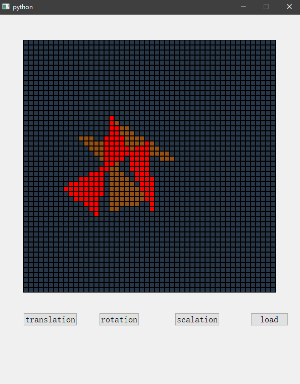
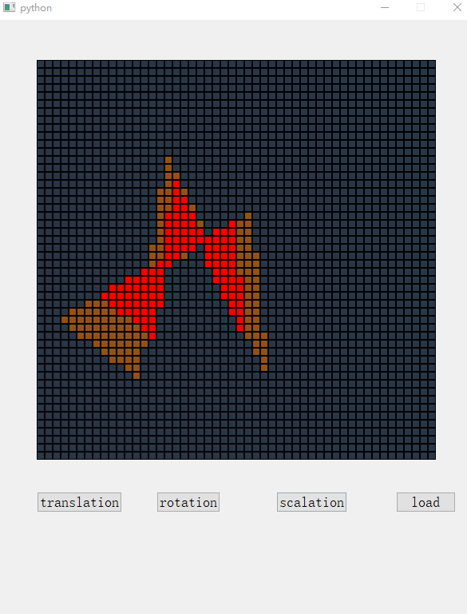
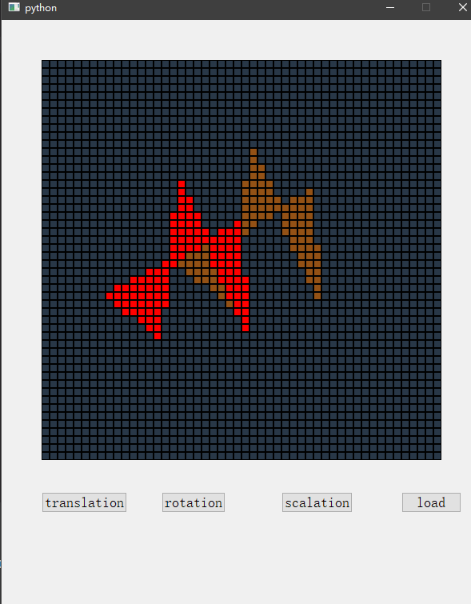

# 计算机图形学 第五周实践报告

+ 姓名：朱桐
+ 学号：10175102111

## 思想

对于园，多边形和直线，分别对顶点进行几何变换，然后绘制新的对应的多边形或者圆

对于平移，把所有点都移动一个距离也可

```py
def translate(self, vec):
    ps = self.get_selected_cords()
    for p in ps:
        x = p
        y = (x[0] + vec[0], x[1] + vec[1])
        if self.check(y[0], y[1]):
            self.get_node(y[0], y[1]).toggle(1)
```

对于旋转，输入三个点代表一个夹角和中心点

```py
def rotate(self):
    print("rotate")
    bp = self.left_clicked[0].get_cord()

    v1 = self.left_clicked[1].get_cord()
    v2 = self.left_clicked[2].get_cord()

    # print(bp, v1, v2)

    v1[0] -= bp[0]
    v2[0] -= bp[0]
    v1[1] -= bp[1]
    v2[1] -= bp[1]
    # print(bp, v1, v2)

    theta = math.acos(dot(v1, v2) / norm(v1) / norm(v2))

    c = math.cos(theta)
    s = math.sin(theta)

    print(theta * 180 / math.pi)

    A = np.array([[c, -s], [s, c]])

    s = self.shape
    if s.shape == "polygon":
        ps = s.data["p"]
        newp = []
        for p in ps:
            vec = np.array([[p[0] - bp[0]], [p[1] - bp[1]]])
            # print(vec, A)
            vec = np.matmul(A, vec)
            # print(vec)
            vec = [int(vec[0][0]), int(vec[1][0])]
            vec = (vec[0] + bp[0], vec[1] + bp[1])
            if self.check(vec[0], vec[1]):
                newp.append(self.get_node(vec[0], vec[1]))

        polygon_fill(newp, self.toggle)
    elif s.shape == "circle":
        bp = s.data["bp"]
        p1 = s.data["p1"]
        dx = bp[0] - p1[0]
        dy = bp[1] - p1[1]
        r = math.sqrt(dx ** 2 + dy ** 2)
        r = int(r + 0.5)
        draw_circle(bp[0], bp[1], r, self.toggle)
```

放缩是根据基准点计算距离，然后坐标等比例放大

```py
def scale(self):
        s = self.shape
        print("scale")
        bp = self.left_clicked[0].get_cord()
        v1 = self.left_clicked[1].get_cord()
        v2 = self.left_clicked[2].get_cord()

        # print(bp, v1, v2)

        for p in self.selected:
            p.toggle(0)
        self.selected = []

        v1[0] -= bp[0]
        v2[0] -= bp[0]
        v1[1] -= bp[1]
        v2[1] -= bp[1]

        d1 = norm(v1)
        d2 = norm(v2)
        if s.shape == "polygon":
            ps = s.data["p"]
            np = []
            for p in ps:
                vec = [p[0] - bp[0], p[1] - bp[1]]
                vec[0] *= d2 / d1
                vec[1] *= d2 / d1
                vec[0] += bp[0]
                vec[1] += bp[1]
                vec = list(map(int, vec))
                print(vec)
                if self.check(vec[0], vec[1]):
                    np.append(self.get_node(vec[0], vec[1]))
            print(np)
            polygon_fill(np, self.toggle)
        elif s.shape == "circle":

            bp = s.data["bp"]
            p1 = s.data["p1"]
            dx = bp[0] - p1[0]
            dy = bp[1] - p1[1]
            r = math.sqrt(dx ** 2 + dy ** 2) * d2 / d1
            r = int(r + 0.5)
            draw_circle(bp[0], bp[1], r, self.toggle)
```


## 效果

旋转


放缩


平移

