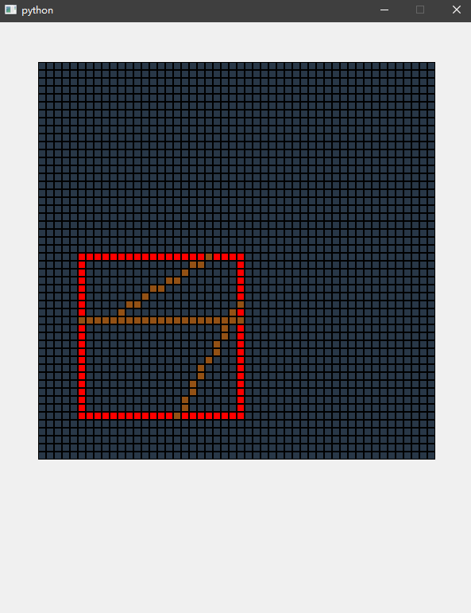

# 计算机图形学 第六次实践报告

+ 姓名：朱桐
+ 学号：10175102111


## Liang-Barsky

使用 Liang-Barsky 完成线段裁剪


clip test 函数，用来判断斜率线段是否落在窗口内

```py
def clip_test(p, q, u1, u2):
    res = True
    r = 0
    if p < 0:
        r = q / p
        if r > u2:
            res = False
        elif r > u1:
            u1 = r
    else:
        if p > 0:
            r = q / p
            if r < u1:
                res = False
            elif r < u2:
                u2 = r
    return res, u1, u2
```

liang barsk 算法再分别对四种情况做讨论, 最后使用 bresenham 绘制线段

```py
def liang_barsk(winMin, winMax, p1, p2, func):
    u1 = 0
    u2 = 1
    dx = p2[0] - p1[0]
    dy = 0

    def clip_test(p, q, u1, u2):
        res = True
        r = 0
        if p < 0:
            r = q / p
            if r > u2:
                res = False
            elif r > u1:
                u1 = r
        else:
            if p > 0:
                r = q / p
                if r < u1:
                    res = False
                elif r < u2:
                    u2 = r
        return res, u1, u2

    res, u1, u2 = clip_test(-dx, p1[0] - winMin[0], u1, u2)
    if res:
        res, u1, u2 = clip_test(dx, winMax[0] - p1[0], u1, u2)
        if res:
            dy = p2[1] - p1[1]
            res, u1, u2 = clip_test(-dy, p1[1] - winMin[1], u1, u2)
            if res:
                res, u1, u2 = clip_test(dy, winMax[1] - p1[1], u1, u2)
                if res:
                    if u2 < 1:
                        p2 = (p1[0] + u2 * dx, p1[1] + u2 * dy)
                    if u1 > 0:
                        p1 = (p1[0] + u1 * dx, p1[1] + u1 * dy)
                    bresenham(
                        [round(p1[0]), round(p1[1])], [round(p2[0]), round(p2[1])], func
                    )
```

## 效果

