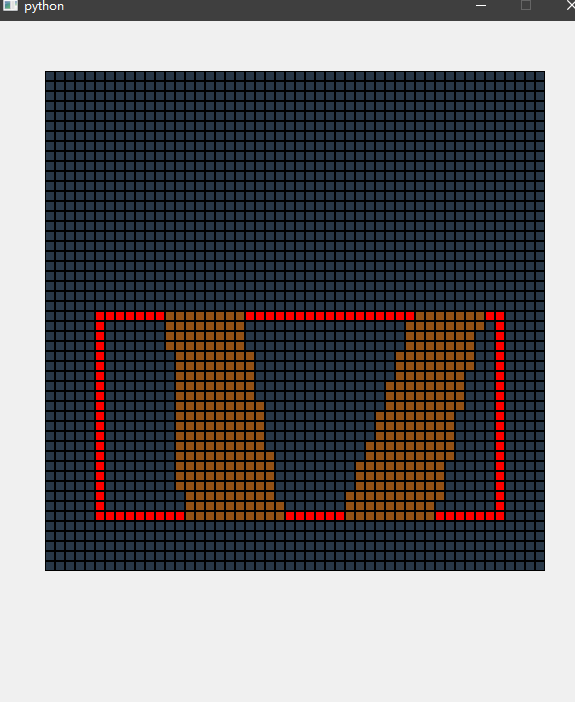

# 计算机图形学 第七次实践报告

+ 姓名：朱桐
+ 学号：10175102111


## Sutherland–Hodgman algorithm

将需要裁剪的多边形按顺逆时针输入，然后分别和矩形的四个边界求交点，这样可以将交点分为入点和出点两个类别，这样就能得到裁剪多边形的顺逆时针输入

如果多边形的边和边界重合，则认为多边形的点是交点

如果已经有两次出点，则提前画出一个多边形，因为已经得到了一个完整的

## 代码

```py
from ..common.grid import Grid, Node

from ..week2.bresenham import bresenham
from ..week4.polygon_fill import polygon_fill

from PyQt5 import QtWidgets
from PyQt5.QtWidgets import (
    QWidget,
    QLabel,
    QApplication,
    QStackedWidget,
    QVBoxLayout,
    QGridLayout,
    QFrame,
    QPushButton,
)
from PyQt5.QtCore import Qt

LEFT = 0
RIGHT = 1
BOTTOM = 2
TOP = 3


def inside(p, b, wMin, wMax):
    if b == LEFT:
        return p[0] >= wMin[0]
    elif b == RIGHT:
        return p[0] <= wMax[0]
    elif b == BOTTOM:
        return p[1] >= wMin[1]
    elif b == TOP:
        return p[1] <= wMax[1]
    

def cross(p1, p2, winEdge, wMin, wMax):
    return inside(p1, winEdge, wMin, wMax) != inside(p2, winEdge, wMin, wMax)

def intersect(p1, p2, winEdge, wMin, wMax):
    iPt = [0, 0]
    m = 0
    if p1[0] != p2[0]:
        m = (p1[1] - p2[1]) / (p1[0] - p2[0])
    if winEdge == LEFT:
        iPt[0] = wMin[0]
        iPt[1] = p2[1] + (wMin[0] - p2[0]) * m
    elif winEdge == RIGHT:
        iPt[0] = wMax[0]
        iPt[1] = p2[1] + (wMax[0] - p2[0]) * m
    elif winEdge == BOTTOM:
        iPt[1] = wMin[1]
        if p1[0] != p2[0]:
            iPt[0] = p2[0] + (wMin[1] - p2[1]) / m
        else:
            iPt[0] = p2[0]
    elif winEdge == TOP:
        iPt[1] = wMax[1]
        if p1[0] != p2[0]:
            iPt[0] = p2[0] + (wMax[1] - p2[1]) / m
        else:
            iPt[0] = p2[0]
    
    return [round(iPt[0]), round(iPt[1])]


def clipPoint(p, winEdge, wMin, wMax, pOut, first, s):
    iPt = [0, 0]
    if first[winEdge] is None:
        first[winEdge] = p
    else:
        if cross(p, s[winEdge], winEdge, wMin,  wMax):
            iPt = intersect(p, s[winEdge], winEdge, wMin, wMax)
            if winEdge < TOP:
                clipPoint(iPt, winEdge+1, wMin, wMax, pOut, first, s)
            else:
                pOut.append(iPt)
    
    s[winEdge] = p

    if inside(p, winEdge, wMin, wMax):
        if winEdge < TOP:
            clipPoint(p, winEdge+1, wMin, wMax, pOut, first, s)
        else:
            pOut.append(p)


def closeClip(wMin, wMax, pOut, first, s):
    pt = [0, 0]
    winEdge = 0
    for winEdge in range(LEFT, TOP + 1):
        if cross(s[winEdge], first[winEdge], winEdge, wMin, wMax):
            pt = intersect(s[winEdge], first[winEdge], winEdge, wMin, wMax)
            if winEdge < TOP:
                clipPoint(pt, winEdge+1, wMin, wMax, pOut, first, s)
            else:
                pOut.append(pt)

def polygonClipSuthHodg(wMin, wMax, pIn, pOut):
    first = [[0, 0] for i in range(4)]
    s = [[0, 0] for i in range(4) ]
    for pk in pIn:
        clipPoint(pk, LEFT, wMin, wMax, pOut, first, s)

    closeClip(wMin, wMax, pOut, first, s)
    
            

class SuthHodgGrid(Grid):
    def __init__(self, border, **params):
        super().__init__(**params)
        p0 = border[0]
        p1 = border[1]
        self.border = border

        def fill(x, y):
            self.toggle(x, y, 2)

        bresenham([p0[0], p0[1]], [p1[0], p0[1]], fill)
        bresenham([p0[0], p0[1]], [p0[0], p1[1]], fill)
        bresenham([p0[0], p1[1]], [p1[0], p1[1]], fill)
        bresenham([p1[0], p0[1]], [p1[0], p1[1]], fill)

        self.p = []

    def dispach(self, node, event):
        
        if event.button() == Qt.LeftButton:
            p = (node.x, node.y)
            self.toggle(p[0], p[1])
            if len(self.p) > 0 and p == self.p[0]:
                print("go")
                ans = []
                polygonClipSuthHodg(self.border[0], self.border[1], self.p, ans)
                ans = list(set([(p[0], p[1]) for p in ans]))
                print(ans)
                polygon_fill([self.get_node(p[0], p[1]) for p in ans], self.toggle)

                self.p = []
            else:
                self.p.append(p)

if __name__ == "__main__":
    import sys

    app = QtWidgets.QApplication(sys.argv)
    gui = SuthHodgGrid(n=50, border=[(5, 5), (45, 25)])
    gui.show()
    sys.exit(app.exec_())
```

## 效果

